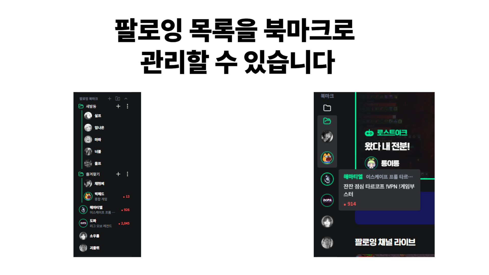
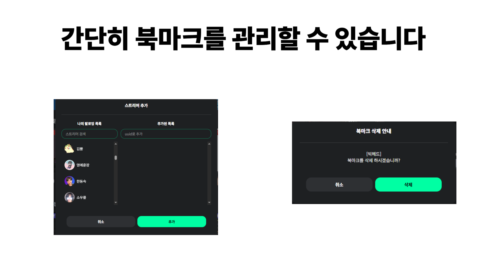
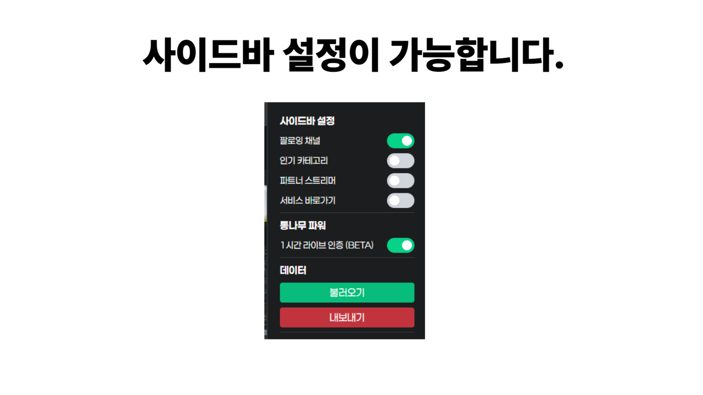

# 치지직 팔로잉 북마크

> 치지직 팔로잉 북마크 및 정리

## 주요기능

- 팔로잉 스트리머 북마크 추가
- 북마크 폴더 정리
- 드래그를 통한 정리 기능
- 사이드바 설정

  



기존 치지직 사이드바에 북마크 탭을 추가했습니다.

북마크에 스트리머를 추가할 때 자신의 팔로잉 목록을 기반으로 손쉽게 추가할 수 있습니다.  
팔로잉 목록에 없는 스트리머는 UUID를 통해 추가 가능합니다.

북마크에서 스트리머를 삭제하려면 우클릭을 통해 가능하고, 폴더 삭제는 별도의 버튼을 통해 가능합니다.

모든 기능은 치지직 로그인을 했을 시 정상 작동합니다.

> 본 확장 프로그램을 사용하여 발생하는 결과에 대한 모든 책임은 사용자에게 있습니다.

## 호환성 여부

현재 크롬 및 엣지에서만 사용가능합니다.

추후 파이어폭스에서 사용가능하도록 수정 예정입니다.

## 업데이트 사항

<details>
<summary>
업데이트 사항
</summary>
- 1.3.8(26.02.08) :
  - 오프라인 스트리머 숨기기 기능이 추가되었습니다.
- 1.3.7(26.02.07) :
  - 북마크 폴더를 열기/닫기 상태가 유지되도록 변경되었습니다.
- 1.3.6(26.02.06) :
  - 치지직 사이트 업데이트로 인해 모달이 정상적으로 보이지 않던 현상 수정
- 1.3.5 :
  - 북마크 탭이 보이지 않는 현상을 임시로 1.3.2 이전 북마크 탭으로 대체
  - 휠클릭 시 새 탭으로 이동 추가
- 1.3.4 : liveStatus 버그 수정
- 1.3.3 : live 우선 끌어올리기 기능 추가 / 폴더 설정 우클릭으로 전환
- 1.3.2 :
  - 추가
    - 북마크 우클릭 시 새 탭으로 이동하기 기능 추가
    - 1분마다 live-status 자동 갱신
  - 개선
    - 북마크 추가 모달 ui/ux 개선
- 1.3.1 : 설정 팝업 창에 미리보기 설정 추가
- 1.3.0 : 미리보기 지원
- 1.2.1 : 북마크 간 간격 조절 및 자잘한 불편사항 개선
- 1.2.0 : 넓은 화면 또는 전체화면 전환 후 복귀 시 북마크 UI가 사라지던 문제를 수정했습니다.
- 1.1.0 : 밝은테마 모드에서도 정상적으로 보이도록 수정했습니다.

</details>

## FAQ

- 북마크에서 스트리머를 삭제하는 법은 우클릭입니다.
- 폴더내부에서 외부로 아이템 이동은 가능하지만 애니메이션이 정상적으로 작동하지 않습니다. 이 부분은 추후 수정 할 예정입니다.

## 크롬 웹 스토어

- [이동하기](https://chromewebstore.google.com/detail/%EC%B9%98%EC%A7%80%EC%A7%81-%ED%8C%94%EB%A1%9C%EC%9E%89-%EB%B6%81%EB%A7%88%ED%81%AC/nbnlaahmoodclieojdkinbajaobplhjg?hl=ko&utm_source=ext_sidebar)

## 버그 제보 및 기능 문의

- che06189@gmail.com

## Build

```bash
# 의존성 설치
yarn install

# 빌드 후 realse 폴더 내부에 realse.zip가 생성
yarn run build
```
